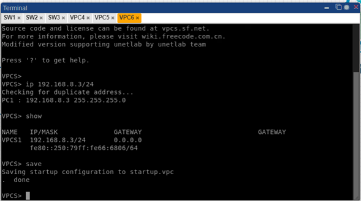
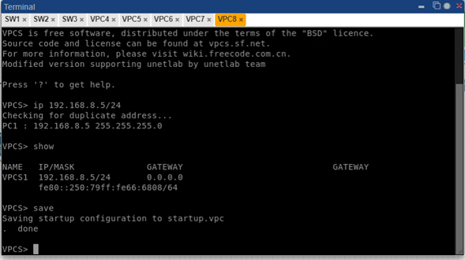
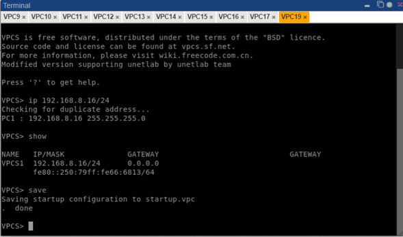
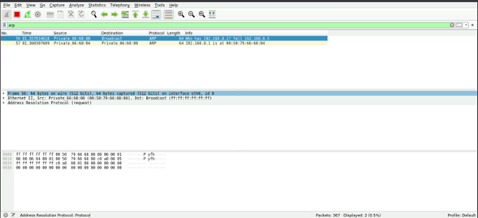
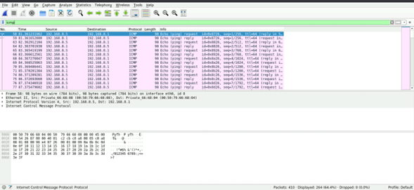
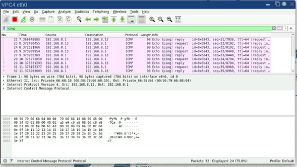

<h2>Resumen de Direcciones IP</h2>

<table>
  <tr>
    <th>Dispositivo</th>
    <th>Dirección IP</th>
    <th>Máscara de Subred</th>
    <th>Área</th>
    <th>Nivel</th>
  </tr>
  <tr>
    <td>VPC4</td>
    <td>192.168.8.1</td>
    <td>255.255.255.0</td>
    <td>Recepción</td>
    <td>Nivel 1</td>
  </tr>
  <tr>
    <td>VPC5</td>
    <td>192.168.8.2</td>
    <td>255.255.255.0</td>
    <td>Recepción</td>
    <td>Nivel 1</td>
  </tr>
  <tr>
    <td>VPC6</td>
    <td>192.168.8.3</td>
    <td>255.255.255.0</td>
    <td>Almacenamiento de paquetes</td>
    <td>Nivel 1</td>
  </tr>
  <tr>
    <td>VPC7</td>
    <td>192.168.8.4</td>
    <td>255.255.255.0</td>
    <td>Almacenamiento de paquetes</td>
    <td>Nivel 1</td>
  </tr>
  <tr>
    <td>VPC8</td>
    <td>192.168.8.5</td>
    <td>255.255.255.0</td>
    <td>atención al cliente</td>
    <td>Nivel 2</td>
  </tr>
  <tr>
    <td>VPC9</td>
    <td>192.168.8.6</td>
    <td>255.255.255.0</td>
    <td>atención al cliente</td>
    <td>Nivel 2</td>
  </tr>
  <tr>
    <td>VPC10</td>
    <td>192.168.8.7</td>
    <td>255.255.255.0</td>
    <td>atención al cliente</td>
    <td>Nivel 2</td>
  </tr>
  <tr>
    <td>VPC11</td>
    <td>192.168.8.8</td>
    <td>255.255.255.0</td>
    <td>atención al cliente</td>
    <td>Nivel 2</td>
  </tr>
  <tr>
    <td>VPC12</td>
    <td>192.168.8.9</td>
    <td>255.255.255.0</td>
    <td>oficina administrativa</td>
    <td>Nivel 2</td>
  </tr>
  <tr>
    <td>VPC13</td>
    <td>192.168.8.10</td>
    <td>255.255.255.0</td>
    <td>oficina administrativa</td>
    <td>Nivel 2</td>
  </tr>
  <tr>
    <td>VPC14</td>
    <td>192.168.8.11</td>
    <td>255.255.255.0</td>
    <td>oficina administrativa</td>
    <td>Nivel 2</td>
  </tr>
  <tr>
    <td>VPC15</td>
    <td>192.168.8.12</td>
    <td>255.255.255.0</td>
    <td>gerencia</td>
    <td>Nivel 3</td>
  </tr>
  <tr>
    <td>VPC16</td>
    <td>192.168.8.13</td>
    <td>255.255.255.0</td>
    <td>gerencia</td>
    <td>Nivel 3</td>
  </tr>
  <tr>
    <td>VPC17</td>
    <td>192.168.8.14</td>
    <td>255.255.255.0</td>
    <td>operaciones</td>
    <td>Nivel 3</td>
  </tr>
  <tr>
    <td>VPC18</td>
    <td>192.168.8.15</td>
    <td>255.255.255.0</td>
    <td>operaciones</td>
    <td>Nivel 3</td>
  </tr>
  <tr>
    <td>VPC19</td>
    <td>192.168.8.16</td>
    <td>255.255.255.0</td>
    <td>operaciones</td>
    <td>Nivel 3</td>
  </tr>
  <!-- Agrega más filas según la cantidad de dispositivos -->
</table>

<h2>Configuración de las VPCs </h2>

Configuración vpc1:

Configuración vpc1:

Configuración vpc1:

ARP:

ICMP1:

ICMP2:

ICMP2:

## Listado de Hardware para Implementación de Topología de Red  🧠

### Switches

1. **Switch de Core:**
   - Modelo: Cisco Catalyst 9300 Series
   - Cantidad: 1
   - Descripción: Switch de alto rendimiento para la gestión centralizada y distribución de la red.

2. **Switches de Distribución:**
   - Modelo: Cisco Catalyst 2960X Series
   - Cantidad: 2
   - Descripción: Switches para la conexión entre niveles y distribución de señal.

### Equipos de Usuario

#### Nivel 1 (Recepción y Almacenamiento)

- Recepción 1:
  - Modelo: Dell OptiPlex 3050
  - Cantidad: 1
- Recepción 2:
  - Modelo: Dell OptiPlex 3050
  - Cantidad: 1
- Almacenamiento 1:
  - Modelo: HP ProDesk 600 G5
  - Cantidad: 1
- Almacenamiento 2:
  - Modelo: HP ProDesk 600 G5
  - Cantidad: 1

#### Nivel 2 (Atención al Cliente y Oficina Administrativa)

- Atención 1:
  - Modelo: Lenovo ThinkCentre M720
  - Cantidad: 1
- Atención 2:
  - Modelo: Lenovo ThinkCentre M720
  - Cantidad: 1
- Atención 3:
  - Modelo: Lenovo ThinkCentre M720
  - Cantidad: 1
- Atención 4:
  - Modelo: Lenovo ThinkCentre M720
  - Cantidad: 1
- Admin 1:
  - Modelo: Dell Latitude 5420
  - Cantidad: 1
- Admin 2:
  - Modelo: Dell Latitude 5420
  - Cantidad: 1
- Admin 3:
  - Modelo: Dell Latitude 5420
  - Cantidad: 1

#### Nivel 3 (Gerencia y Operaciones)

- Gerencia 1:
  - Modelo: MacBook Pro
  - Cantidad: 1
- Gerencia 2:
  - Modelo: MacBook Pro
  - Cantidad: 1Modelo: Cisco Catalyst 9300 Series
- Operaciones 1:
  - Modelo: HP ZBook Studio G7
  - Cantidad: 1
- Operaciones 2:
  - Modelo: HP ZBook Studio G7
  - Cantidad: 1
- Operaciones 3:
  - Modelo: HP ZBook Studio G7
  - Cantidad: 1

### Switches para Conexión de Usuarios

#### Nivel 1 (Recepción y Almacenamiento)

- Switch de Nivel 1:
  - Modelo: Cisco Catalyst 2960X Series
  - Cantidad: 1

#### Nivel 2 (Atención al Cliente y Oficina Administrativa)

- Switch de Nivel 2:
  - Modelo: Cisco Catalyst 2960X Series
  - Cantidad: 1

#### Nivel 3 (Gerencia y Operaciones)

- Switch de Nivel 3:
  - Modelo: Cisco Catalyst 9300 Series
  - Cantidad: 1

## Funcionamiento del Protocolo ARP

El Protocolo de Resolución de Direcciones (ARP) es esencial en redes Ethernet e IP, permitiendo a los dispositivos encontrar la dirección física (MAC) asociada a una dirección IP en la misma red local. Aquí se describe en detalle cómo funciona el protocolo ARP:

1. **Solicitud ARP (ARP Request):** Cuando un dispositivo necesita enviar un paquete a una dirección IP específica, primero verifica su tabla ARP local. Si la dirección MAC correspondiente no está allí, envía una solicitud ARP broadcast para preguntar quién tiene la dirección IP buscada.

2. **Recepción de la Solicitud ARP:** Todos los dispositivos en la misma red local reciben la solicitud ARP. Solo el dispositivo con la dirección IP destino responderá.

3. **Respuesta ARP (ARP Reply):** El dispositivo con la dirección IP solicitada responde con un mensaje ARP broadcast que contiene su dirección MAC. Esta respuesta se envía directamente al dispositivo que hizo la solicitud ARP original.

4. **Actualización de la Tabla ARP:** El dispositivo que originó la solicitud ARP recibe la respuesta y actualiza su tabla ARP local con la dirección IP y la dirección MAC correspondientes.

5. **Caché ARP:** Los dispositivos suelen mantener en caché las entradas de la tabla ARP por un tiempo determinado (Tiempo de Vida de la Entrada ARP) para acelerar futuras resoluciones de direcciones.

6. **Comunicación Usando la Dirección MAC:** Con la dirección MAC del destino conocida, el dispositivo encapsula el paquete en una trama Ethernet con la dirección MAC correcta. Esto garantiza la entrega precisa del paquete en la red local.
