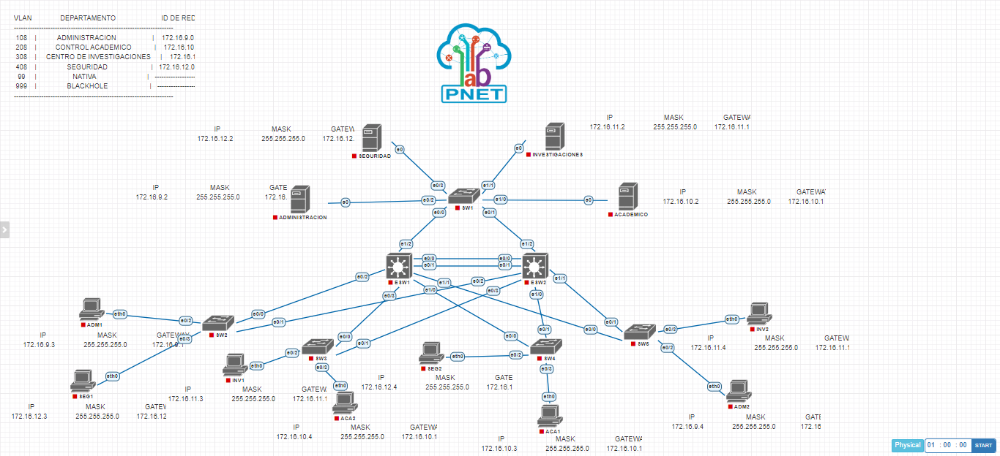
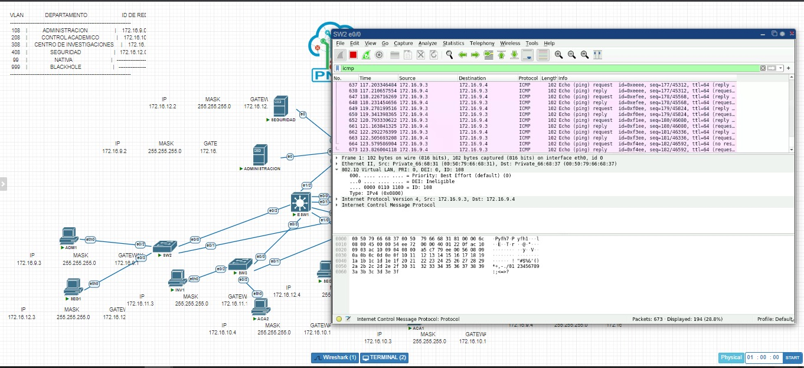
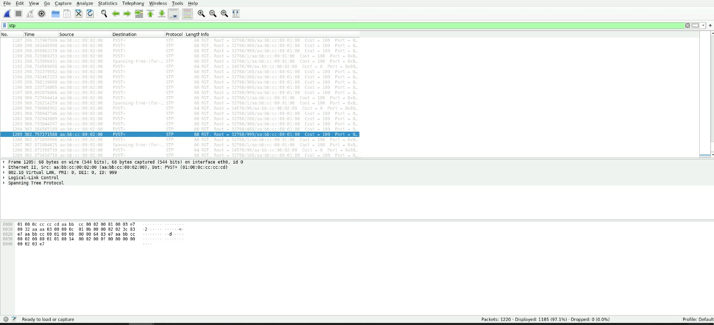

# Manual técnico 

### Proyecto 1 Redes 1

#### Integrantes:

<ul>
    <li>Carlos Eduardo Soto Marroquín - 201902502</li>
    <li>Carlos Javier Martínez Polanco - 201709282</li>
</ul>

#### Tabla de direcciones

<table>
  <thead>
    <tr>
      <th>Departamento</th>
      <th>Dirección IP</th>
      <th>Máscara de Subred</th>
      <th>Puerta de Enlace Predeterminada</th>
      <th>VLAN</th>
    </tr>
  </thead>
  <tbody>
    <tr>
      <td>Administración</td>
      <td>172.16.9.2</td>
      <td>255.255.255.0</td>
      <td>172.16.9.1</td>
      <td>108</td>
    </tr>
    <tr>
      <td>Centro Académico</td>
      <td>172.16.10.2</td>
      <td>255.255.255.0</td>
      <td>172.16.10.1</td>
      <td>208</td>
    </tr>
    <tr>
      <td>Centro de Investigación</td>
      <td>172.16.11.2</td>
      <td>255.255.255.0</td>
      <td>172.16.11.1</td>
      <td>308</td>
    </tr>
    <tr>
      <td>Seguridad</td>
      <td>172.16.12.2</td>
      <td>255.255.255.0</td>
      <td>172.16.12.1</td>
      <td>408</td>
    </tr>
    <tr>
      <td>ADM1 (VPC)</td>
      <td>172.16.9.3/24</td>
      <td>255.255.255.0</td>
      <td>172.16.9.1</td>
      <td>108</td>
    </tr>
    <tr>
      <td>ADM2 (VPC)</td>
      <td>172.16.9.4/24</td>
      <td>255.255.255.0</td>
      <td>172.16.9.1</td>
      <td>108</td>
    </tr>
    <tr>
      <td>ACA1 (VPC)</td>
      <td>172.16.10.3/24</td>
      <td>255.255.255.0</td>
      <td>172.16.10.1</td>
      <td>208</td>
    </tr>
    <tr>
      <td>ACA2 (VPC)</td>
      <td>172.16.10.4/24</td>
      <td>255.255.255.0</td>
      <td>172.16.10.1</td>
      <td>208</td>
    </tr>
    <tr>
      <td>INV1 (VPC)</td>
      <td>172.16.11.3/24</td>
      <td>255.255.255.0</td>
      <td>172.16.11.1</td>
      <td>308</td>
    </tr>
    <tr>
      <td>INV2 (VPC)</td>
      <td>172.16.11.4/24</td>
      <td>255.255.255.0</td>
      <td>172.16.11.1</td>
      <td>308</td>
    </tr>
    <tr>
      <td>SEG1 (VPC)</td>
      <td>172.16.12.3/24</td>
      <td>255.255.255.0</td>
      <td>172.16.12.1</td>
      <td>408</td>
    </tr>
    <tr>
      <td>SEG2 (VPC)</td>
      <td>172.16.12.4/24</td>
      <td>255.255.255.0</td>
      <td>172.16.12.1</td>
      <td>408</td>
    </tr>
  </tbody>
</table>

#### Implementación de la topología

  

#### Construcción de la topología

CONFIGURACION DE SERVERS

<ul>
  <li>Administracion
    <ul>
      <li>
ip:172.16.9.2
</li>
      <li>
mask:255.255.255.0
</li>
      <li>
getway:172.16.9.1
</li>
    </ul>
  </li>
  <li>Centro academico
    <ul>
      <li>
ip:172.16.10.2
</li>
      <li>
mask:255.255.255.0
</li>
      <li>
getway:172.16.10.1
</li>
    </ul>
  </li>
  <li>Centro de Investigaciones
    <ul>
      <li>
ip:172.16.11.2
</li>
      <li>
mask:255.255.255.0
</li>
      <li>
getway:172.16.11.1
</li>
    </ul>
  </li>
  <li>Seguridad
    <ul>
      <li>
172.16.12.2
</li>
      <li>
mask:255.255.255.0
</li>
      <li>
getway:172.16.12.1
</li>
    </ul>
  </li>
</ul>

CONFIGURACION DE LAS VPC

<ul>
  <li>ADM1
    <ul>
      <li>set pcname ADM1</li>
      <li>ip 172.16.9.3/24 172.16.9.1</li>
      <li>save</li>
    </ul>
  </li>
  <li>ADM2
    <ul>
      <li>set pcname ADM2</li>
      <li>ip 172.16.9.4/24 172.16.9.1</li>
      <li>save</li>
    </ul>
  </li>
  <li>ACA1
    <ul>
      <li>set pcname ACA1</li>
      <li>ip 172.16.10.3/24 172.16.10.1</li>
      <li>save</li>
    </ul>
  </li>
  <li>ACA2
    <ul>
      <li>set pcname ACA2</li>
      <li>ip 172.16.10.4/24 172.16.10.1</li>
      <li>save</li>
    </ul>
  </li>
  <li>INV1
    <ul>
      <li>set pcname INV1</li>
      <li>ip 172.16.11.3/24 172.16.11.1</li>
      <li>save</li>
    </ul>
  </li>
  <li>INV2
    <ul>
      <li>set pcname INV1</li>
      <li>ip 172.16.11.4/24 172.16.11.1</li>
      <li>save</li>
    </ul>
  </li>
  <li>SEG1
    <ul>
      <li>set pcname SEG1</li>
      <li>ip 172.16.12.3/24 172.16.12.1</li>
      <li>save</li>
    </ul>
  </li>
  <li>SEG2
    <ul>
      <li>set pcname SEG2</li>
      <li>ip 172.16.12.4/24 172.16.12.1</li>
      <li>save</li>
    </ul>
  </li>
</ul>

CONFIGURACION DE LOS SWITCHES CAPA 2

<ul>
  <li>SW1
    <ul>
      <li>enable</li>
      <li>configure terminal</li>
      <li>hostname SW1</li>
      <li>vtp domain pareja08</li>
      <li>vtp password usac</li>
      <li>vtp version 2</li>
      <li>vtp mode client</li>
      <li>interface range e0/0 - 1</li>
      <li>switchport mode trunk</li>
      <li>switchport trunk encapsulation dot1q</li>
      <li>switchport trunk allowed vlan all</li>
      <li>switchport trunk native vlan 99</li>
      <li>interface e0/2</li>
      <li>switchport mode access</li>
      <li>switchport access vlan 108</li>
      <li>interface e0/3</li>
      <li>switchport mode access</li>
      <li>switchport access vlan 408</li>
      <li>interface e1/1</li>
      <li>switchport mode access/li>
      <li>switchport access vlan 308</li>
      <li>interface e1/0</li>
      <li>switchport mode access</li>
      <li>switchport access vlan 208</li>
      <li>interface range e1/2 - 3, e2/0 - 3, e3/0 - 1</li>
      <li>switchport mode access</li>
      <li>switchport access vlan 999</li>
      <li>spanning-tree mode rapid-pvst</li>
      <li>spanning-tree vlan 99</li>
      <li>end</li>
      <li>write memory</li>
    </ul>
  </li>
</ul>

<ul>
  <li>SW2
    <ul>
      <li>enable</li>
      <li>configure terminal</li>
      <li>hostname SW2</li>
      <li>vtp domain pareja08</li>
      <li>vtp password usac</li>
      <li>vtp version 2</li>
      <li>vtp mode client</li>
      <li>interface range e0/0 - 1</li>
      <li>switchport mode trunk</li>
      <li>switchport trunk encapsulation dot1q</li>
      <li>switchport trunk allowed vlan all</li>
      <li>switchport trunk native vlan 99</li>
      <li>interface e0/2</li>
      <li>switchport mode access</li>
      <li>switchport access vlan 108</li>
      <li>interface e0/3</li>
      <li>switchport mode access</li>
      <li>switchport access vlan 408</li>
      <li>interface range e1/0 - 3, e2/0 - 3, e3/0 - 3</li>
      <li>switchport mode access</li>
      <li>switchport access vlan 999</li>
      <li>spanning-tree mode rapid-pvst</li>
      <li>spanning-tree vlan 99</li>
      <li>end</li>
      <li>write memory</li>
    </ul>
  </li>
</ul>

<ul>
  <li>SW3
    <ul>
      <li>enable</li>
      <li>configure terminal</li>
      <li>hostname SW3</li>
      <li>vtp domain pareja08</li>
      <li>vtp password usac</li>
      <li>vtp version 2</li>
      <li>vtp mode client</li>
      <li>interface range e0/0 - 1</li>
      <li>switchport mode trunk</li>
      <li>switchport trunk encapsulation dot1q</li>
      <li>switchport trunk allowed vlan all</li>
      <li>switchport trunk native vlan 99</li>
      <li>interface e0/2</li>
      <li>switchport mode access</li>
      <li>switchport access vlan 308</li>
      <li>interface e0/3</li>
      <li>switchport mode access</li>
      <li>switchport access vlan 208</li>
      <li>interface range e1/0 - 3, e2/0 - 3, e3/0 - 3</li>
      <li>switchport mode access</li>
      <li>switchport access vlan 999</li>
      <li>spanning-tree mode rapid-pvst</li>
      <li>spanning-tree vlan 99</li>
      <li>end</li>
      <li>write memory</li>
    </ul>
  </li>
</ul>
<ul>
  <li>SW4
    <ul>
      <li>enable</li>
      <li>configure terminal</li>
      <li>hostname SW4</li>
      <li>vtp domain pareja08</li>
      <li>vtp password usac</li>
      <li>vtp version 2</li>
      <li>vtp mode client</li>
      <li>interface range e0/0 - 1</li>
      <li>switchport mode trunk</li>
      <li>switchport trunk encapsulation dot1q</li>
      <li>switchport trunk allowed vlan all</li>
      <li>switchport trunk native vlan 99</li>
      <li>interface e0/2</li>
      <li>switchport mode access</li>
      <li>switchport access vlan 408</li>
      <li>interface e0/3</li>
      <li>switchport mode access</li>
      <li>switchport access vlan 208</li>
      <li>interface range e1/0 - 3, e2/0 - 3, e3/0 - 3</li>
      <li>switchport mode access</li>
      <li>switchport access vlan 999</li>
      <li>spanning-tree mode rapid-pvst</li>
      <li>spanning-tree vlan 99</li>
      <li>end</li>
      <li>write memory</li>
    </ul>
  </li>
</ul>

<ul>
  <li>SW5
    <ul>
      <li>enable</li>
      <li>configure terminal</li>
      <li>hostname SW5</li>
      <li>vtp domain pareja08</li>
      <li>vtp password usac</li>
      <li>vtp version 2</li>
      <li>vtp mode client</li>
      <li>interface range e0/0 - 1</li>
      <li>switchport mode trunk</li>
      <li>switchport trunk encapsulation dot1q</li>
      <li>switchport trunk allowed vlan all</li>
      <li>switchport trunk native vlan 99</li>
      <li>interface e0/2</li>
      <li>switchport mode access</li>
      <li>switchport access vlan 108</li>
      <li>interface e0/3</li>
      <li>switchport mode access</li>
      <li>switchport access vlan 308</li>
      <li>interface range e1/0 - 3, e2/0 - 3, e3/0 - 3</li>
      <li>switchport mode access</li>
      <li>switchport access vlan 999</li>
      <li>spanning-tree mode rapid-pvst</li>
      <li>spanning-tree vlan 99</li>
      <li>end</li>
      <li>write memory</li>
    </ul>
  </li>
</ul>

CONFIGURACION DE SWITCHES CAPA 3

<ul>
  <li>ESW1
    <ul>
      <li>enable</li>
      <li>configure terminal</li>
      <li>hostname ESW1</li>
      <li>vtp domain pareja08</li>
      <li>vtp password usac</li>
      <li>vtp version 2</li>
      <li>vtp mode server</li>
      <li>vlan 108</li>
      <li>name ADMINISTRACION</li>
      <li>vlan 208</li>
      <li>name ACADEMICO</li>
      <li>vlan 308</li>
      <li>name INVESTIGACIONES</li>
      <li>vlan 408</li>
      <li>name SEGURIDAD</li>
      <li>vlan 99</li>
      <li>name NATIVA</li>
      <li>vlan 999</li>
      <li>name BLACKHOLE</li>
      <li>interface range e0/0 - 3, e1/0 - 2</li>
      <li>switchport mode trunk</li>
      <li>switchport trunk encapsulation dot1q</li>
      <li>switchport trunk allowed vlan all</li>
      <li>switchport trunk native vlan 99</li>
      <li>spanning-tree vlan 99 root primary</li>
      <li>spanning-tree mode rapid-pvst</li>
      <li>end</li>
      <li>write memory</li>
    </ul>
  </li>
</ul>

<ul>
  <li>ESW2
    <ul>
      <li>enable</li>
      <li>configure terminal</li>
      <li>hostname ESW2</li>
      <li>vtp domain pareja08</li>
      <li>vtp password usac</li>
      <li>vtp version 2</li>
      <li>vtp mode transparent</li>
      <li>vlan 108</li>
      <li>name ADMINISTRACION</li>
      <li>vlan 208</li>
      <li>name ACADEMICO</li>
      <li>vlan 308</li>
      <li>name INVESTIGACIONES</li>
      <li>vlan 408</li>
      <li>name SEGURIDAD</li>
      <li>vlan 99</li>
      <li>name NATIVA</li>
      <li>vlan 999</li>
      <li>name BLACKHOLE</li>
      <li>interface range e0/0 - 3, e1/0 - 2</li>
      <li>switchport mode trunk</li>
      <li>switchport trunk encapsulation dot1q</li>
      <li>switchport trunk allowed vlan all</li>
      <li>switchport trunk native vlan 99</li>
      <li>spanning-tree vlan 99 root primary</li>
      <li>end</li>
      <li>write memory</li>
    </ul>
  </li>
</ul>

### Capturas de WireShark de ICMCP y STP

#### ICMP:

  

Es un protocolo que se utiliza dentro de una red para comunicar problemas con las transmisión de datos. Una de las principales maneras en que se utiliza un ICMP es determinar si los datos llegan a su destino y en el momento correcto.

#### STP:

  

El STP, definido por el estándar IEEE 802.1d es un protocolo que funciona en el <strong>nivel de la capa 2</strong> del modelo OSI y su principal objetivo es controlar los enlaces redundantes, asegurando el rendimiento de una red.

#### Presupuesto

Para que una topologia funciones de manera correcta, ademas de que cada dispostivo debe contener una configuracion correcta, se debe contar una calidad alta en cada dispositovo, por lo que se recomienda siempre comprar productos de alta calidad y certificados, para garantizar el buen funcionamiento de todo el ambiente.

<table>
  <thead>
    <tr>
      <th>Cantidad</th>
      <th>Detalles de materiales</th>
      <th colspan="2">Expresion en Q</th>
    </tr>
  </thead>
  <tbody>
    <tr>
      <td></td>
      <td></td>
      <td>Unitario</td>
      <td>Total</td>
    </tr>
    <tr>
      <td>20</td>
      <td>Metros de cable UTP Cat. 6</td>
      <td>20.00</td>
      <td>839.20</td>
    </tr>
    <tr>
      <td>5</td>
      <td>Patch panel (24 Puertos CAT 6 Tipo Keystone)</td>
      <td>1,151</td>
      <td>5,755</td>
    </tr>
      <td>7</td>
      <td>Switch (Cisco Catalyst capa L2/L3 - 08puertos)</td>
      <td>1637.95</td>
      <td>11,465.65</td>
    </tr>
    <tr>
      <td>1</td>
      <td>Access Point Ubiquiti AC Pro</td>
      <td>2,300.00/Mes</td>
      <td>2,300.00</td>
    </tr>
    <tr>
      <td>1</td>
      <td>gabinete o rack</td>
      <td>5,819.00</td>
      <td>5,819.00</td>
    </tr>
    <tr>
      <td colspan="2">Total (GTQ)</td>
      <td>----------</td>
      <td>Q.26,178.85</td>
    </tr>
  </tbody>
</table>
