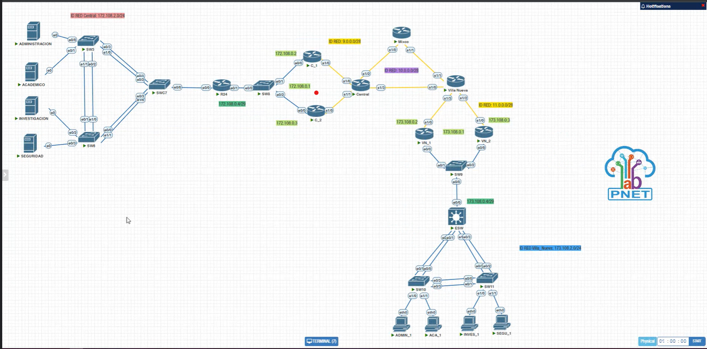

# Manual Técnico

<center>

### Proyecto 1 Redes 1

</center>

#### Integrantes:

<ul>
    <li>Carlos Eduardo Soto Marroquín - 201902502</li>
    <li>Carlos Javier Martínez Polanco - 201709282</li>
</ul>


## Parte 1: Navegando por las Direcciones IP


| Dispositivo   | Direccion IP | Mascara de subred  | Puerta de enlace | VLAN     |
|---------------|--------------|--------------------|------------------|----------|
| ACADEMICO     | 172.108.2.1  | 255.255.255.224    | 172.108.2.31     | VLAN 108 |
| INVESTIGACION | 172.108.2.33 | 255.255.255.240    | 172.108.2.47     | VLAN 208 |
| ADMINISTRACION| 172.108.2.49 | 255.255.255.240    | 172.108.2.63     | VLAN 308 |
| SEGURIDAD     | 172.108.2.65 | 255.255.255.248    | 172.108.2.71     | VLAN 408 |
| ACA_1         | 173.108.2.1  | 255.255.255.224    | 173.108.2.31     | VLAN 308 |
| SEGU_1        | 173.108.2.33 | 255.255.255.240    | 173.108.2.47     | VLAN 208 |
| INVES_1       | 173.108.2.49 | 255.255.255.240    | 173.108.2.63     | VLAN 508 |
| ADMIN_1       | 173.108.2.65 | 255.255.255.248    | 173.108.2.71     | VLAN 108 |


## Parte 2: Redes

### Redes VLSM de Central

| Subred        | Nº de Hosts| ID de Red    | IP de red       | Máscara         | Primer Host  | Último Host  | Broadcast    | Puerta de enlace  |
|---------------|------------|------------- |-----------------|-----------------|--------------|--------------|--------------|-------------------|
| ACADEMICO     | 30         | 172.108.2.0  | 172.108.2.0 /27 | 255.255.255.224 | 172.108.2.1  | 172.108.2.30 | 172.108.2.31 | 172.108.2.1       |
| INVESTIGACION | 14         | 172.108.2.32 | 172.108.2.32/28 | 255.255.255.240 | 172.108.2.33 | 172.108.2.46 | 172.108.2.47 | 172.108.2.33      |
| ADMINISTRACION| 14         | 172.108.2.48 | 172.108.2.48/28 | 255.255.255.240 | 172.108.2.49 | 172.108.2.62 | 172.108.2.63 | 172.108.2.49      |
| SEGURIDAD     | 6          | 172.108.2.64 | 172.108.2.64/29 | 255.255.255.248 | 172.108.2.65 | 172.108.2.70 | 172.108.2.71 | 172.108.2.65      |


### Redes VLSM de Villa Nueva

| Subred         | Nº de Hosts | ID de Red     | IP de red       | Máscara         | Primer Host  | Último Host  | Broadcast    | Puerta de enlace |
|----------------|-------------|---------------|-----------------|-----------------|--------------|--------------|--------------|------------------|
| ACADEMICO      | 30          | 173.108.2.0   | 173.108.2.0 /27 | 255.255.255.224 | 173.108.2.1  | 173.108.2.30 | 173.108.2.31 | 173.108.2.1      |
| SEGURIDAD      | 14          | 173.108.2.32  | 173.108.2.32 /28| 255.255.255.240 | 173.108.2.33 | 173.108.2.46 | 173.108.2.47 | 173.108.2.33     |
| INVESTIGACION  | 14          | 173.108.2.48  | 173.108.2.48 /28| 255.255.255.240 | 173.108.2.49 | 173.108.2.62 | 173.108.2.63 | 173.108.2.49     |
| ADMINISTRACION | 6           | 173.108.2.64  | 173.108.2.64 /29| 255.255.255.248 | 173.108.2.65 | 173.108.2.70 | 173.108.2.71 | 173.108.2.65     |


## Parte 3: Calculo de VLSM de Central


- Ejemplo de calculo de la subred ACADEMICO

- Número de Hosts: Según la tabla, se necesitan 30 hosts en esta subred.
    - ID de Red: Ya está proporcionado en la tabla, es "172.108.2.0".
    - IP de Red: También está en la tabla, es "172.108.2.0/27", lo que significa que los primeros 27 bits están reservados para la red.
    - Máscara: La máscara de subred es "255.255.255.224", que en notación CIDR es "/27".
    - Primer Host: Para calcularlo, sumamos 1 a la dirección de red: 172.108.2.0 + 1 = 172.108.2.1
    - Entonces, el primer host en esta subred es "172.108.2.1".
    - Último Host: Para calcularlo, restamos 1 al broadcast:
    - Broadcast: 172.108.2.31
    - Último Host: 172.108.2.31 - 1 = 172.108.2.30
    - El último host en esta subred es "172.108.2.30".
    - Broadcast: El broadcast para esta subred es "172.108.2.31".
    - Puerta de enlace: Por convención, la puerta de enlace suele ser la primera dirección IP de la subred, que es el "Primer Host" (o primera ip utilizable). Entonces, la puerta de enlace es "172.108.2.1".

- Este procedimiento se repite en cada subred

- Obtenemos como reusltado lo siguiente:


| Área           | Número de Hosts | ID de Red      | IP de Red        | Máscara          | Primer Host    | Último Host    | Broadcast      | Puerta de enlace |
| -------------- | --------------- | -------------- | ----------------- | ----------------- | -------------- | -------------- | -------------- | --------------- |
| ACADEMICO      | 30              | 172.108.2.0    | 172.108.2.0/27    | 255.255.255.224   | 172.108.2.1    | 172.108.2.30   | 172.108.2.31   | 172.108.2.1     |
| INVESTIGACION  | 14              | 172.108.2.32   | 172.108.2.32/28   | 255.255.255.240   | 172.108.2.33   | 172.108.2.46   | 172.108.2.47   | 172.108.2.33    |
| ADMINISTRACION | 14              | 172.108.2.48   | 172.108.2.48/28   | 255.255.255.240   | 172.108.2.49   | 172.108.2.62   | 172.108.2.63   | 172.108.2.49    |
| SEGURIDAD      | 6               | 172.108.2.64   | 172.108.2.64/29   | 255.255.255.248   | 172.108.2.65   | 172.108.2.70   | 172.108.2.71   | 172.108.2.65    |


## Parte 4 : Topologia



## Parte 5 : Configuracion de la Topologia

### Configuración de la Sede Central

#### Configuración SWC7:

```plaintext
enable
configure terminal
hostname SWC7
spanning-tree vlan 1,108,208,308,408 root primary
spanning-tree mode rapid-pvst
vtp domain pareja08
vpt password usac
vtp version 2
vtp mode server
vlan 108
name ACADEMICO
vlan 208
name INVESTIGACION
vlan 308
name ADMINISTRACION
vlan 408
name SEGURIDAD
end
interface e0/0
switchport trunk encapsulation dot1q
switchport mode trunk
switchport trunk allowed vlan all
switchport trunk native vlan 1
no shutdown
interface range e0/1-2
channel-group 1 mode desirable
switchport trunk encapsulation dot1q
switchport mode trunk
switchport trunk allowed vlan all
switchport trunk native vlan 1
no shutdown
interface range e0/3,e1/0
channel-group 2 mode desirable
switchport trunk encapsulation dot1q
switchport mode trunk
switchport trunk allowed vlan all
switchport trunk native vlan 1
no shutdown
exit
do write
end
write memory
```

### Configuración de SW5:

```plaintext
enable
configure terminal
hostname SW5
spanning-tree mode rapid-pvst
spanning-tree vlan 1
vtp domain pareja08
vtp password usac
vtp version 2
vtp mode client
end

interface range e0/3,e1/0
channel-group 1 mode desirable
switchport trunk encapsulation dot1q
switchport mode trunk
switchport trunk allowed vlan all
switchport trunk native vlan 1
no shutdown

interface range e0/2, e1/1
channel-group 3 mode desirable
switchport trunk encapsulation dot1q
switchport mode trunk
switchport trunk allowed vlan all
switchport trunk native vlan 1
no shutdown

interface e0/0
switchport mode access
switchport access vlan 308
no shutdown

interface e0/1
switchport mode access
switchport access vlan 108
no shutdown

exit
do write
end
```

### Configuración de SW6:

```plaintext
enable
configure terminal
hostname SW6
spanning-tree mode rapid-pvst
spanning-tree vlan 1
vtp domain pareja08
vtp password usac
vtp version 2
vtp mode client
end

interface range e0/0,e1/1
channel-group 2 mode desirable
switchport trunk encapsulation dot1q
switchport mode trunk
switchport trunk allowed vlan all
switchport trunk native vlan 1
no shutdown

interface range e0/1, e1/0
channel-group 3 mode desirable
switchport trunk encapsulation dot1q
switchport mode trunk
switchport trunk allowed vlan all
switchport trunk native vlan 1
no shutdown

interface e0/2
switchport mode access
switchport access vlan 208
no shutdown

interface e0/3
switchport mode access
switchport access vlan 408
no shutdown

exit
do write
end
write memory
```

### Configuración de Router R24 (R):

```plaintext
enable
configure terminal
hostname R24

interface e0/0
no shutdown

interface e0/0.108
encapsulation dot1q 108
ip address 172.108.2.1 255.255.255.224
no shutdown

interface e0/0.208
encapsulation dot1q 208
ip address 172.108.2.33 255.255.255.240
no shutdown

interface e0/0.308
encapsulation dot1q 308
ip address 172.108.2.49 255.255.255.240
no shutdown

interface e0/0.408
encapsulation dot1q 408
ip address 172.108.2.65 255.255.255.248
no shutdown

end
write memory
```


### Configuración de ESW:

```plaintext
enable
configure terminal
hostname ESW
spanning-tree vlan 1,108,208,308,508 root primary
spanning-tree mode rapid-pvst
vtp domain pareja08_2
vtp password usac
vtp version 2
vtp mode server
vlan 108
name ACADEMICO
vlan 208
name INVESTIGACION
vlan 308
name ADMINISTRACION
vlan 508
name SEGURIDAD

interface e0/0
no switchport
ip address 173.108.0.4 255.255.255.248
no shutdown

interface range e0/1-2
channel-group 1 mode active
switchport trunk encapsulation dot1q
switchport mode trunk
switchport trunk allowed vlan all
switchport trunk native vlan 1
no shutdown

interface range e0/3,e1/0
channel-group 2 mode active
switchport trunk encapsulation dot1q
switchport mode trunk
switchport trunk allowed vlan all
switchport trunk native vlan 1
no shutdown

interface vlan 308
ip address 173.108.2.1 255.255.255.224
no shutdown

interface vlan 208
ip address 173.108.2.33 255.255.255.240
no shutdown

interface vlan 508
ip address 173.108.2.49 255.255.255.240
no shutdown

interface vlan 108
ip address 173.108.2.65 255.255.255.248
no shutdown

ip routing
exit
do write
end
write memory

```

### Configuración de SW10:

```plaintext
!Configuracion SW10:
enable
configure terminal
hostname SW10
spanning-tree mode rapid-pvst
spanning-tree vlan 1
vtp domain pareja08_2
vtp password usac
vtp version 2
vtp mode client

interface range e0/0-1
channel-group 1 mode active
switchport trunk encapsulation dot1q
switchport mode trunk
switchport trunk allowed vlan all
switchport trunk native vlan 1
no shutdown

interface range e0/2-3
channel-group 3 mode active
switchport trunk encapsulation dot1q
switchport mode trunk
switchport trunk allowed vlan all
switchport trunk native vlan 1
no shutdown

interface e1/0
switchport mode access
switchport access vlan 308
no shutdown

interface e1/1
switchport mode access 
switchport access vlan 108
no shutdown

exit
do write
end
write memory

```


### Configuración de SW11:

```plaintext
!Configuracion SW11:
enable
configure terminal
hostname SW11
spanning-tree mode rapid-pvst
spanning-tree vlan 1
vtp domain pareja08_2
vtp password usac
vtp version 2
vtp mode client

interface range e0/2-3
channel-group 2 mode active
switchport trunk encapsulation dot1q
switchport mode trunk
switchport trunk allowed vlan all
switchport trunk native vlan 1
no shutdown

interface range e0/0-1
channel-group 3 mode active
switchport trunk encapsulation dot1q
switchport mode trunk
switchport trunk allowed vlan all
switchport trunk native vlan 1
no shutdown

interface e1/0
switchport mode access
switchport access vlan 508
no shutdown

interface e1/1
switchport mode access 
switchport access vlan 208
no shutdown

exit
do write
end
write memory

```

### Configuración de las VPC:

```plaintext
!CONFIGURACION DE LAS VPC
!ADMIN_1
set pcname ADMIN_1
ip 173.108.2.66/29 173.108.2.65
save

!ACA_1
set pcname ACA_1
ip 173.108.2.2/27 173.108.2.1
save

!INVES_1
set pcname INVES_1
ip 173.108.2.50/28 173.108.2.49
save

!SEGU_1
set pcname SEGU_1
ip 173.108.2.34/28 173.108.2.33

```


